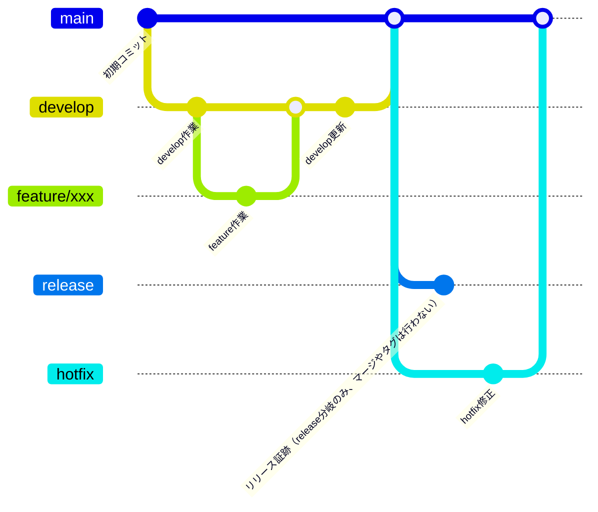

# 概要
ゲームコミュニティ用ウェブサイトのインフラ部分を実装しています。
管理対象として当システム全体の構成図を含みます。

## 構成
- /front-front-web-site-for-riften-terraform/riften_web_server/terraform/base
  - modules
- a

## 構成図
構成図を格納しています。
- /front-web-site-for-riften-terraform/diagram/architecture.drawio
  - アーキテクチャ図
- /front-web-site-for-riften-terraform/diagram/workflow.md
  - ワークフロー図
- /front-web-site-for-riften-terraform/diagram/要件定義書_RIFシステム.md
  - 要件定義書
- /front-web-site-for-riften-terraform/diagram/調達仕様書_RIFシステム.md
  - 調達仕様書

## 開発
### 事前準備
Windows 11 以上の環境で `git` と `docker` をインストールし、`openssh` で鍵を作成してください。
### 開発環境
以下のコマンドを`Git Bash`環境で実行してください。
```
# 初回起動時
bash build_command.sh first-up
```
```
# 起動時
bash build_command.sh up
```
```
# 接続時
bash build_command.sh exec
```
```
# イメージ更新時
bash build_command.sh rebuild
```
```
# コンテナ削除
bash build_command.sh down
```

### プッシュ
github に差分をプッシュする際には git-flow を簡略化し運用してください。Github Actions などの実装を簡略化するためタグは使用しません。
- git-flow
  - https://www.atlassian.com/git/tutorials/comparing-workflows/gitflow-workflow

| ブランチ名      | 用途・説明                                      | 直接コミット禁止 | マージ先          | ブランチ作成元     |
|:---------------|:-----------------------------------------------|:----------------|:-------------------|:-------------------|
| main           | stg・prod 環境へリリースするブランチ               | ○               | -                 | -            |
| release        | 本番リリース後証跡｜切り戻し用ブランチ              | ○               | -                 | main          |
| hotfix         | main へ修正を入れる際に使用（リリース後のバグ修正等）| ×               | main              | main               |
| develop        | dev 環境へリリースするブランチ                     | ○               | main              | -  |
| feature/*      | 作業ブランチ（ローカル・dev 環境での動作確認も実施） | ×               | develop           | develop            |

### ブランチ運用フロー
Mermaid 記法のため必要に応じて vs code に拡張機能をインストールしてください。
例：Markdown Preview Mermaid


### PR事前作業
ソースを更新する際にはフォーマッタとバリデートのコマンドを実行・修正したのちPRを作成してください。
- フォーマッタ
```
cd /front-web-site-for-riften-terraform/riften_web_server/terraform/${ENV}
terraform fmt -recursive
```
- バリデータ
```
cd /front-web-site-for-riften-terraform/riften_web_server/terraform/${ENV}
terraform validate
```

### 実行
デプロイする各環境に対して実行してください。
```
cd /front-web-site-for-riften-terraform/riften_web_server/terraform/{ENV}
terraform init -var-file=terraform.tfvars
terraform plan -var-file=terraform.tfvars
terraform deploy -var-file=terraform.tfvars
```

### デストロイ
デストロイする各環境に対して実行してください。
```
cd /front-web-site-for-riften-terraform/riften_web_server/terraform/{ENV}
terraform destroy -var-file=terraform.tfvarss
```
