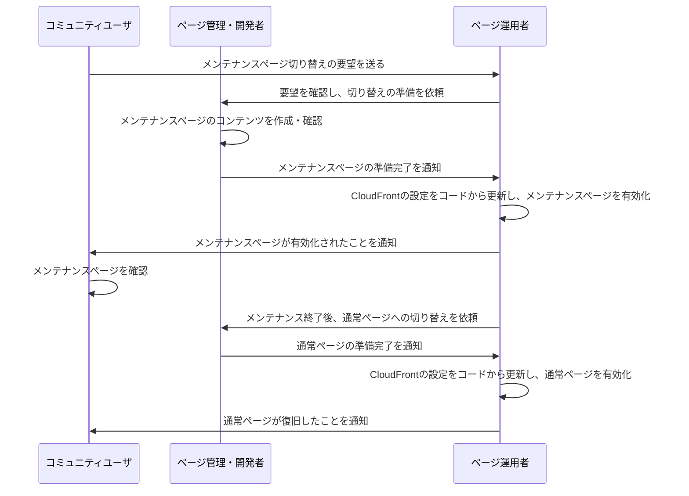

```mermaid
%% ワークフロー図: CloudFrontのメンテナンスページ切り替え
%% 役割: コミュニティユーザ、ページ管理・開発者、ページ運用者
sequenceDiagram
    participant User as コミュニティユーザ
    participant Dev as ページ管理・開発者
    participant Ops as ページ運用者

    User->>Ops: メンテナンスページ切り替えの要望を送る
    Ops->>Dev: 要望を確認し、切り替えの準備を依頼
    Dev->>Dev: メンテナンスページのコンテンツを作成・確認
    Dev->>Ops: メンテナンスページの準備完了を通知
    Ops->>Ops: CloudFrontの設定をコードから更新し、メンテナンスページを有効化
    Ops->>User: メンテナンスページが有効化されたことを通知
    User->>User: メンテナンスページを確認
    Ops->>Dev: メンテナンス終了後、通常ページへの切り替えを依頼
    Dev->>Ops: 通常ページの準備完了を通知
    Ops->>Ops: CloudFrontの設定をコードから更新し、通常ページを有効化
    Ops->>User: 通常ページが復旧したことを通知
```
