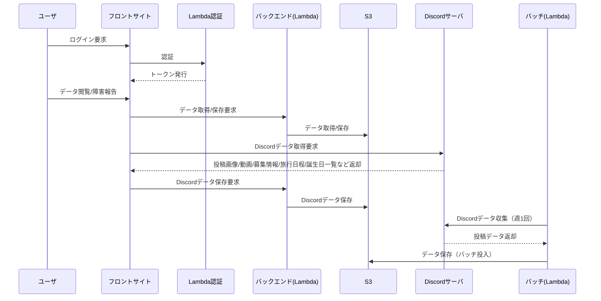

```mermaid
sequenceDiagram
  participant U as ユーザ
  participant F as フロントサイト
  participant L as Lambda認証
  participant BE as バックエンド(Lambda)
  participant S as S3
  participant D as Discordサーバ
  participant B as バッチ(Lambda)
  U->>F: ログイン要求
  F->>L: 認証
  L-->>F: トークン発行
  U->>F: データ閲覧/障害報告
  F->>BE: データ取得/保存要求
  BE->>S: データ取得/保存
  F->>D: Discordデータ取得要求
  D-->>F: 投稿画像/動画/募集情報/旅行日程/誕生日一覧など返却
  F->>BE: Discordデータ保存要求
  BE->>S: Discordデータ保存
  B->>D: Discordデータ収集（週1回）
  D-->>B: 投稿データ返却
  B->>S: データ保存（バッチ投入）
```
