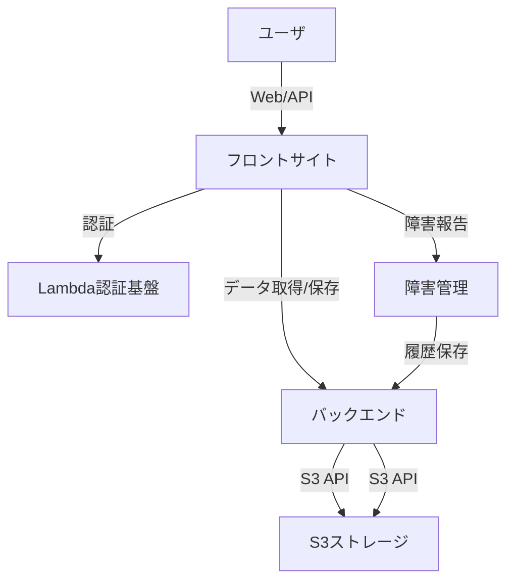

```mermaid
flowchart TD
  A[ユーザ] -->|Web/API| B[フロントサイト]
  B -->|認証| C[Lambda認証基盤]
  B -->|データ取得/保存| F[バックエンド]
  F -->|S3 API| D[S3ストレージ]
  B -->|障害報告| E[障害管理]
  E -->|履歴保存| F
  F -->|S3 API| D
```
