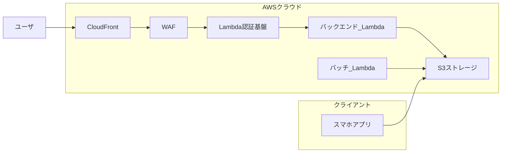

```mermaid
flowchart LR
  subgraph AWSクラウド
    CF[CloudFront]
    WAF[WAF]
    L[Lambda認証基盤]
    BE[バックエンド_Lambda]
    BATCH[バッチ_Lambda]
    S3[S3ストレージ]
  end
  User[ユーザ] --> CF
  CF --> WAF
  WAF --> L
  L --> BE
  BE --> S3
  BATCH --> S3
  subgraph クライアント
    APP[スマホアプリ]
  end
  APP --> S3
```
