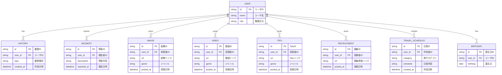

```mermaid
erDiagram
  USER {
    string id PK "ユーザID"
    string name "ユーザ名"
    string role "権限区分"
  }
  HISTORY {
    string id PK "履歴ID"
    string user_id FK "ユーザID"
    string type "履歴種別"
    datetime created_at "作成日時"
  }
  INCIDENT {
    string id PK "障害ID"
    string user_id FK "報告者ID"
    string description "障害内容"
    datetime reported_at "報告日時"
  }
    BIRTHDAY {
    string id PK "誕生日ID"
    string user_id FK "ユーザID"
    date birthday "誕生日"
  }
  IMAGE {
    string id PK "画像ID"
    string user_id FK "投稿者ID"
    string url "画像リンク"
    string genre "ジャンル"
    datetime posted_at "投稿日時"
  }
  VIDEO {
    string id PK "動画ID"
    string user_id FK "投稿者ID"
    string url "動画リンク"
    string genre "ジャンル"
    datetime posted_at "投稿日時"
  }
  TIPS {
    string id PK "TipsID"
    string user_id FK "投稿者ID"
    string url "Tipsリンク"
    string genre "ジャンル"
    datetime posted_at "投稿日時"
  }
  RECRUITMENT {
    string id PK "募集ID"
    string user_id FK "投稿者ID"
    string url "募集情報リンク"
    datetime posted_at "投稿日時"
  }
  TRAVEL_SCHEDULE {
    string id PK "日程ID"
    string user_id FK "作成者ID"
    string category "旅行カテゴリ"
    string schedule "日程内容"
    datetime created_at "作成日時"
  }
  USER ||--o{ HISTORY : has
  USER ||--o{ INCIDENT : reports
  USER ||--o{ IMAGE : posts
  USER ||--o{ VIDEO : posts
  USER ||--o{ TIPS : posts
  USER ||--o{ RECRUITMENT : posts
  USER ||--o{ TRAVEL_SCHEDULE : creates
  USER ||--o{ BIRTHDAY : has
```
