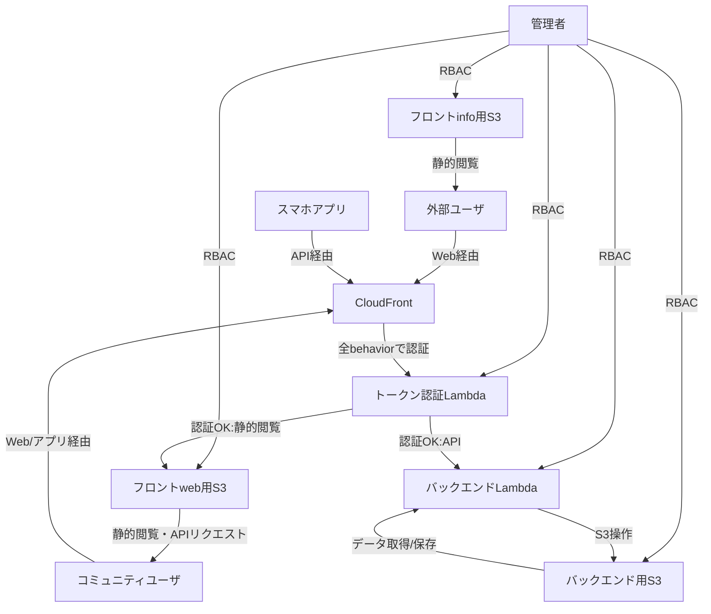

```mermaid
flowchart TD
  Admin[管理者] -->|RBAC| S3_Info[フロントinfo用S3]
  Admin -->|RBAC| S3_Front[フロントweb用S3]
  Admin -->|RBAC| S3_Backend[バックエンド用S3]
  Admin -->|RBAC| Lambda[バックエンドLambda]
  Admin -->|RBAC| AuthLambda[トークン認証Lambda]
  Member[コミュニティユーザ] -->|Web/アプリ経由| CloudFront
  User[外部ユーザ] -->|Web経由| CloudFront
  App[スマホアプリ] -->|API経由| CloudFront
  CloudFront -->|全behaviorで認証| AuthLambda
  AuthLambda -- 認証OK:静的閲覧 --> S3_Front
  AuthLambda -- 認証OK:API --> Lambda
  Lambda -->|S3操作| S3_Backend
  S3_Info -- 静的閲覧 --> User
  S3_Front -- 静的閲覧・APIリクエスト --> Member
  S3_Backend -- データ取得/保存 --> Lambda
```
