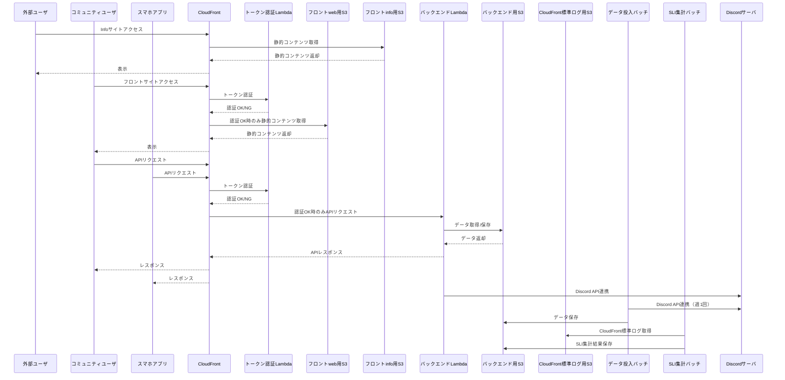

```mermaid
sequenceDiagram
  participant User as 外部ユーザ
  participant Member as コミュニティユーザ
  participant App as スマホアプリ
  participant CF as CloudFront
  participant AuthLambda as トークン認証Lambda
  participant FrontS3 as フロントweb用S3
  participant InfoS3 as フロントinfo用S3
  participant BackendLambda as バックエンドLambda
  participant BackendS3 as バックエンド用S3
  participant CFLogS3 as CloudFront標準ログ用S3
  participant DataBatch as データ投入バッチ
  participant SLI_Batch as SLI集計バッチ
  participant Discord as Discordサーバ
  %% 外部ユーザのInfoサイト閲覧
  User->>CF: Infoサイトアクセス
  CF->>InfoS3: 静的コンテンツ取得
  InfoS3-->>CF: 静的コンテンツ返却
  CF-->>User: 表示
  %% コミュニティユーザのフロントサイト利用
  Member->>CF: フロントサイトアクセス
  CF->>AuthLambda: トークン認証
  AuthLambda-->>CF: 認証OK/NG
  CF->>FrontS3: 認証OK時のみ静的コンテンツ取得
  FrontS3-->>CF: 静的コンテンツ返却
  CF-->>Member: 表示
  %% APIリクエスト（フロント/アプリ）
  Member->>CF: APIリクエスト
  App->>CF: APIリクエスト
  CF->>AuthLambda: トークン認証
  AuthLambda-->>CF: 認証OK/NG
  CF->>BackendLambda: 認証OK時のみAPIリクエスト
  BackendLambda->>BackendS3: データ取得/保存
  BackendS3-->>BackendLambda: データ返却
  BackendLambda-->>CF: APIレスポンス
  CF-->>Member: レスポンス
  CF-->>App: レスポンス
  %% Discord連携
  BackendLambda->>Discord: Discord API連携
  DataBatch->>Discord: Discord API連携（週1回）
  DataBatch->>BackendS3: データ保存
  %% SLI集計・アラート
  SLI_Batch->>CFLogS3: CloudFront標準ログ取得
  SLI_Batch->>BackendS3: SLI集計結果保存
  %% CloudWatchアラーム（図略:メトリクス→Discord通知）
```
