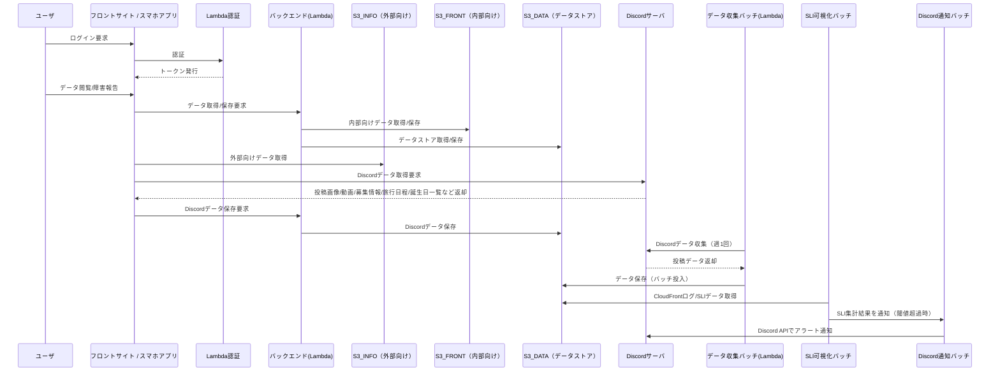

```mermaid
sequenceDiagram
  participant U as ユーザ
  participant F as フロントサイト / スマホアプリ
  participant L as Lambda認証
  participant BE as バックエンド(Lambda)
  participant S_INFO as S3_INFO（外部向け）
  participant S_FRONT as S3_FRONT（内部向け）
  participant S_DATA as S3_DATA（データストア）
  participant D as Discordサーバ
  participant B as データ収集バッチ(Lambda)
  participant SLI_B as SLI可視化バッチ
  participant DIS_B as Discord通知バッチ
  U->>F: ログイン要求
  F->>L: 認証
  L-->>F: トークン発行
  U->>F: データ閲覧/障害報告
  F->>BE: データ取得/保存要求
  BE->>S_FRONT: 内部向けデータ取得/保存
  BE->>S_DATA: データストア取得/保存
  F->>S_INFO: 外部向けデータ取得
  F->>D: Discordデータ取得要求
  D-->>F: 投稿画像/動画/募集情報/旅行日程/誕生日一覧など返却
  F->>BE: Discordデータ保存要求
  BE->>S_DATA: Discordデータ保存
  B->>D: Discordデータ収集（週1回）
  D-->>B: 投稿データ返却
  B->>S_DATA: データ保存（バッチ投入）
  SLI_B->>S_DATA: CloudFrontログ/SLIデータ取得
  SLI_B->>DIS_B: SLI集計結果を通知（閾値超過時）
  DIS_B->>D: Discord APIでアラート通知
```
