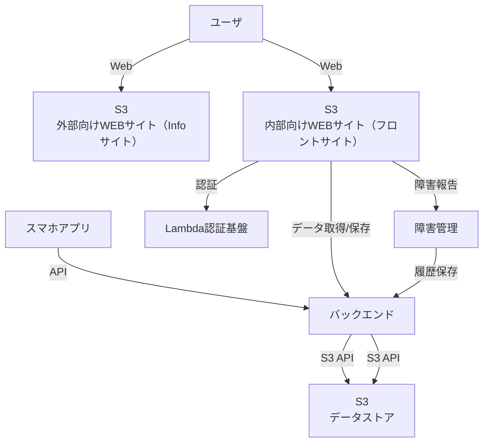

```mermaid
flowchart TD
  A[ユーザ] -->|Web| S3_INFO[S3\n外部向けWEBサイト（Infoサイト）]
  A -->|Web| S3_FRONT[S3\n内部向けWEBサイト（フロントサイト）]
  APP[スマホアプリ] -->|API| F[バックエンド]
  S3_FRONT -->|認証| C[Lambda認証基盤]
  S3_FRONT -->|データ取得/保存| F
  F -->|S3 API| S3_DATA[S3\nデータストア]
  S3_FRONT -->|障害報告| E[障害管理]
  E -->|履歴保存| F
  F -->|S3 API| S3_DATA
```
