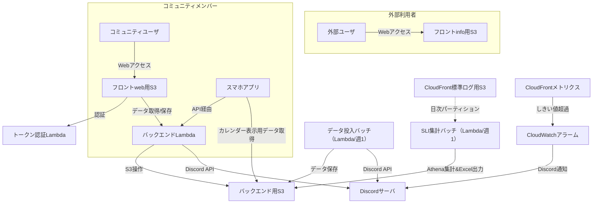

```mermaid
flowchart TD
subgraph 外部利用者
  User[外部ユーザ]
  User -->|Webアクセス| S3_Info[フロントinfo用S3]
end
subgraph コミュニティメンバー
  Member[コミュニティユーザ]
  Member -->|Webアクセス| S3_Front[フロントweb用S3]
  App[スマホアプリ] -->|API経由| BackendLambda[バックエンドLambda]
end
S3_Front -->|認証| AuthLambda[トークン認証Lambda]
S3_Front -->|データ取得/保存| BackendLambda
BackendLambda -->|S3操作| S3_Backend[バックエンド用S3]
%% バッチ処理
DataBatch[データ投入バッチ（Lambda/週1）] -->|データ保存| S3_Backend
%% SLI集計バッチ
S3_CFLog[CloudFront標準ログ用S3]
SLI_Batch[SLI集計バッチ（Lambda/週1）]
S3_CFLog -. 日次パーティション .-> SLI_Batch
SLI_Batch -->|Athena集計&Excel出力| S3_Backend
%% CloudFrontメトリクス&アラート
CF_Metrics[CloudFrontメトリクス] -->|しきい値超過| CW_Alarm[CloudWatchアラーム]
CW_Alarm -->|Discord通知| Discord[Discordサーバ]
%% Discord連携
BackendLambda -->|Discord API| Discord
DataBatch -->|Discord API| Discord
%% スマホアプリのデータ取得
App -->|カレンダー表示用データ取得| S3_Backend
```
