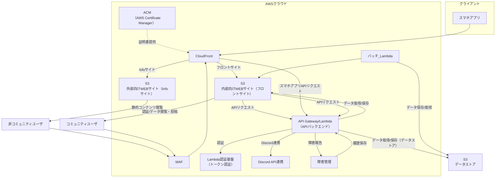

```mermaid
flowchart TD
  subgraph AWSクラウド
    ACM[ACM\n（AWS Certificate Manager）]
    WAF[WAF]
    CF[CloudFront]
    S3_INFO[S3\n外部向けWEBサイト（Infoサイト）]
    S3_FRONT[S3\n内部向けWEBサイト（フロントサイト）]
    API[API Gateway/Lambda\n（APIバックエンド）]
    AUTH[Lambda認証基盤\n（トークン認証）]
    BATCH[バッチ_Lambda]
    DISCORD[Discord API連携]
    ERROR[障害管理]
  end
  User[非コミュニティユーザ] --> WAF
  User2[コミュニティユーザ] --> WAF
  WAF --> CF
  ACM -. 証明書提供 .-> CF
  CF -- Infoサイト --> S3_INFO
  CF -- フロントサイト --> S3_FRONT
  S3_INFO -- 静的コンテンツ閲覧 --> User
  S3_FRONT -- 認証/データ閲覧・投稿 --> User2
  S3_FRONT -- APIリクエスト --> API
  API -- 認証 --> AUTH
  API -- データ取得/保存 --> S3_FRONT
  API -- データ取得/保存（データストア） --> S3_DATA[S3\nデータストア]
  API -- 障害報告 --> ERROR
  API -- Discord連携 --> DISCORD
  BATCH --> S3_FRONT
  BATCH -- データ保存/取得 --> S3_DATA
  ERROR -- 履歴保存 --> API
  subgraph クライアント
    APP[スマホアプリ]
  end
  APP --> CF
  CF -- スマホアプリAPIリクエスト --> API
  S3_FRONT -- APIリクエスト --> API
```

---
`ACM（AWS Certificate Manager）`は、CloudFrontなどで利用するSSL/TLS証明書を一元管理・自動更新するサービスです。本構成ではCloudFrontのHTTPS通信にACM発行の証明書を利用しています。
