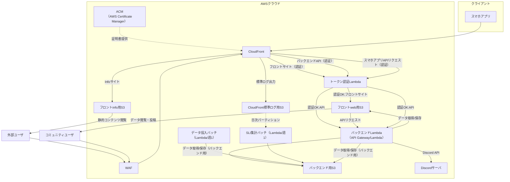

```mermaid
flowchart TD
  subgraph AWSクラウド
    ACM[ACM\n（AWS Certificate Manager）]
    WAF[WAF]
    CF[CloudFront]
  S3_Info[フロントinfo用S3]
  S3_Front[フロントweb用S3]
  S3_Backend[バックエンド用S3]
  S3_CFLog[CloudFront標準ログ用S3]
  API[バックエンドLambda（API Gateway/Lambda）]
  AuthLambda[トークン認証Lambda]
  DataBatch[データ投入バッチ（Lambda/週1）]
  SLI_Batch[SLI集計バッチ（Lambda/週1）]
  Discord[Discordサーバ]
  end
  User[外部ユーザ] --> WAF
  Member[コミュニティユーザ] --> WAF
  WAF --> CF
  ACM -. 証明書提供 .-> CF
  CF -- Infoサイト --> S3_Info
  CF -- フロントサイト（認証） --> AuthLambda
  CF -- バックエンドAPI（認証） --> AuthLambda
  CF -- 標準ログ出力 --> S3_CFLog
  AuthLambda -- 認証OK:フロントサイト --> S3_Front
  AuthLambda -- 認証OK:API --> API
  S3_Info -- 静的コンテンツ閲覧 --> User
  S3_Front -- データ閲覧・投稿 --> Member
  S3_Front -- APIリクエスト --> API
  API -- データ取得/保存 --> S3_Front
  API -- データ取得/保存（バックエンド用） --> S3_Backend
  API -- Discord API --> Discord
  DataBatch --> S3_Backend
  SLI_Batch --> S3_Backend
  S3_CFLog -. 日次パーティション .-> SLI_Batch
  subgraph クライアント
    App[スマホアプリ]
  end
  App --> CF
  CF -- スマホアプリAPIリクエスト（認証） --> AuthLambda
  AuthLambda -- 認証OK:API --> API
  API -- データ取得/保存（バックエンド用） --> S3_Backend
```
