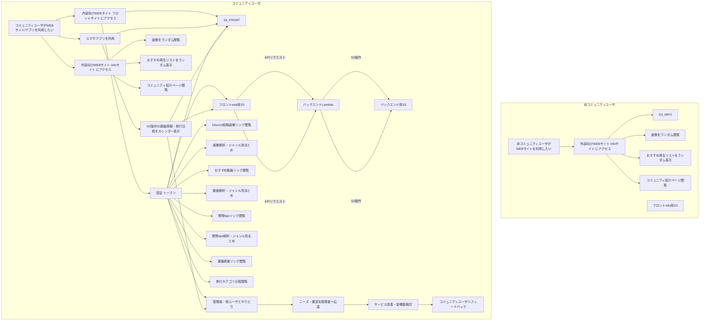

```mermaid
flowchart TD
  subgraph 非コミュニティユーザ
    NA[非コミュニティユーザがWEBサイトを利用したい]
    NB[外部向けWEBサイト Infoサイト にアクセス]
    NB1[画像をランダム閲覧]
    NB2[おすすめ再生リストをランダム表示]
    NB3[コミュニティ紹介ページ閲覧]
    S3_Info[フロントinfo用S3]
    NB --> S3_INFO
    NA --> NB
    NB --> NB1
    NB --> NB2
    NB --> NB3
  end

  subgraph コミュニティユーザ
    A[コミュニティユーザがWEBサイト/アプリを利用したい]
    B[外部向けWEBサイト Infoサイト にアクセス]
    C[内部向けWEBサイト フロントサイト にアクセス]
    D[スマホアプリを利用]
    B1[画像をランダム閲覧]
    B2[おすすめ再生リストをランダム表示]
    B3[コミュニティ紹介ページ閲覧]
    C1[認証 トークン ]
    C2[Discord投稿画像リンク閲覧]
    C3[画像解析・ジャンル別まとめ]
    C4[おすすめ動画リンク閲覧]
    C5[動画解析・ジャンル別まとめ]
    C6[開発tipsリンク閲覧]
    C7[開発tips解析・ジャンル別まとめ]
    C8[募集情報リンク閲覧]
    C9[旅行カテゴリ日程閲覧]
    D1[S3保存の募集情報・旅行日程をカレンダー表示]
    S3_Front[フロントweb用S3]
    S3_Backend[バックエンド用S3]
    C --> S3_FRONT
    D --> S3_FRONT
    %% API/データストアへのアクセスは必ずCloudFront→トークン認証Lambda→バックエンドLambda経由
    C1 --> S3_FRONT
    C1 --> S3_Front
    S3_Front -->|APIリクエスト| BackendLambda[バックエンドLambda]
    BackendLambda -->|S3操作| S3_Backend
    D1 --> S3_FRONT
    D1 --> S3_Front
    S3_Front -->|APIリクエスト| BackendLambda
    BackendLambda -->|S3操作| S3_Backend
    E[管理者・他ユーザとやりとり]
    F[ニーズ・要望を管理者へ伝達]
    G[サービス改善・新機能検討]
    H[コミュニティユーザへフィードバック]

    A --> B
    A --> C
    A --> D
    B --> B1
    B --> B2
    B --> B3
    C --> C1
    C1 --> C2
    C1 --> C3
    C1 --> C4
    C1 --> C5
    C1 --> C6
    C1 --> C7
    C1 --> C8
    C1 --> C9
    D --> D1
    C1 --> E
    D1 --> E
    E --> F
    F --> G
    G --> H
  end
```
